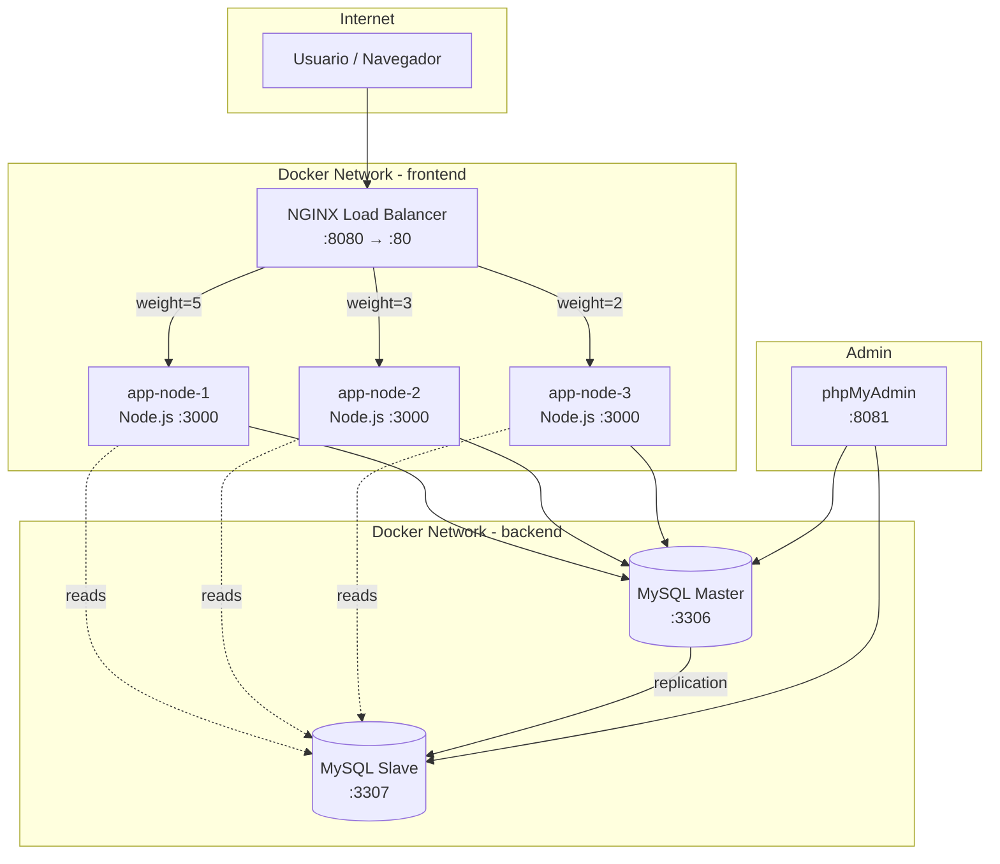

# Implementación del Sistema de Gestión de Viajes Turísticos "Turix"

Sistema distribuido con Docker Compose para la materia de Aplicaciones Distribuidas (EPN-ESFOT, 2026-A).

## Análisis del Repositorio de Referencia

Se analizó el repositorio `Josselyn-Ayo/BalanceDeCarga-Prueba2`. Puntos clave extraídos:

| Aspecto | Referencia | Nuestra Adaptación |
|---|---|---|
| Backend | Flask (Python) | **Node.js + Express** |
| Frontend | Templates Jinja2 | **React (Vite)** |
| Base de datos | MySQL 8.0 (Master) | **MySQL 8.0 (Master + Slave)** |
| Balanceador | NGINX (round-robin simple) | **NGINX (weighted load balancing)** |
| Nodos app | 2 contenedores | **3 contenedores** |
| Admin DB | No incluido | **phpMyAdmin** |

> [!IMPORTANT]
> La referencia usa solo 2 nodos y round-robin. Nuestro proyecto **requiere 3 nodos** con **balanceo por pesos** y **replicación Master-Slave** con lógica de failover de lectura.

---

## Arquitectura del Sistema



---

## Estructura de Carpetas del Proyecto

```
Turix/
├── docker-compose.yml                 # Orquestación de todos los servicios
├── .env                               # Variables de entorno centralizadas
├── nginx/
│   └── nginx.conf                     # Config NGINX con weighted balancing
├── mysql/
│   ├── master/
│   │   ├── init.sql                   # Schema + seed data
│   │   └── master.cnf                 # Config de replicación master
│   └── slave/
│       └── slave.cnf                  # Config de replicación slave
├── backend/
│   ├── Dockerfile                     # Multi-stage build Node.js
│   ├── package.json
│   ├── .env.example
│   └── src/
│       ├── index.js                   # Entry point Express
│       ├── config/
│       │   └── db.js                  # Pool connections Master/Slave
│       ├── middleware/
│       │   ├── auth.js                # JWT verification
│       │   └── errorHandler.js        # Error handling centralizado
│       ├── routes/
│       │   ├── auth.routes.js         # Login / Register
│       │   ├── trips.routes.js        # CRUD viajes (admin)
│       │   └── shop.routes.js         # Carrito + compra (usuario)
│       ├── controllers/
│       │   ├── auth.controller.js
│       │   ├── trips.controller.js
│       │   └── shop.controller.js
│       ├── models/
│       │   ├── user.model.js
│       │   ├── trip.model.js
│       │   └── order.model.js
│       └── utils/
│           └── validators.js          # Validaciones de negocio
├── frontend/
│   ├── Dockerfile                     # Multi-stage build React
│   ├── package.json
│   ├── vite.config.js
│   ├── index.html
│   └── src/
│       ├── main.jsx
│       ├── App.jsx
│       ├── api/
│       │   └── client.js             # Axios instance
│       ├── context/
│       │   ├── AuthContext.jsx
│       │   └── CartContext.jsx
│       ├── pages/
│       │   ├── LoginPage.jsx
│       │   ├── CatalogPage.jsx       # Búsqueda y listado público
│       │   ├── TripDetailPage.jsx
│       │   ├── CartPage.jsx
│       │   ├── CheckoutPage.jsx
│       │   └── admin/
│       │       ├── DashboardPage.jsx
│       │       └── TripFormPage.jsx   # Crear/Editar viaje
│       ├── components/
│       │   ├── Navbar.jsx
│       │   ├── TripCard.jsx
│       │   ├── CartItem.jsx
│       │   ├── SearchBar.jsx
│       │   └── ServerBadge.jsx        # Muestra qué nodo respondió
│       └── styles/
│           └── index.css
└── scripts/
    ├── setup-replication.sh           # Configura replicación Master→Slave
    └── load-test.sh                   # Script de pruebas de carga
```

---

## Fase 1: Diseño de la Base de Datos

### Motor: MySQL 8.0 (compatible con replicación binlog nativa)

### Esquema Relacional

```sql
-- ============================================
-- SCHEMA: turix_db
-- Diseñado para replicación Master-Slave
-- ============================================

CREATE DATABASE IF NOT EXISTS turix_db;
USE turix_db;

-- Tabla de Usuarios
CREATE TABLE users (
    id INT AUTO_INCREMENT PRIMARY KEY,
    email VARCHAR(255) NOT NULL UNIQUE,
    password_hash VARCHAR(255) NOT NULL,
    full_name VARCHAR(150) NOT NULL,
    role ENUM('admin', 'user') DEFAULT 'user',
    created_at TIMESTAMP DEFAULT CURRENT_TIMESTAMP,
    updated_at TIMESTAMP DEFAULT CURRENT_TIMESTAMP ON UPDATE CURRENT_TIMESTAMP,
    INDEX idx_email (email),
    INDEX idx_role (role)
) ENGINE=InnoDB DEFAULT CHARSET=utf8mb4;

-- Tabla de Categorías de Viaje
CREATE TABLE categories (
    id INT AUTO_INCREMENT PRIMARY KEY,
    name VARCHAR(100) NOT NULL UNIQUE,
    description TEXT,
    icon VARCHAR(50)
) ENGINE=InnoDB DEFAULT CHARSET=utf8mb4;

-- Tabla de Paquetes de Viaje / Destinos Turísticos
CREATE TABLE trips (
    id INT AUTO_INCREMENT PRIMARY KEY,
    code VARCHAR(20) NOT NULL UNIQUE,            -- Código único obligatorio
    name VARCHAR(200) NOT NULL,                  -- Nombre del destino
    description TEXT NOT NULL,                   -- Descripción detallada
    destination VARCHAR(200) NOT NULL,           -- Ubicación geográfica
    available_slots INT NOT NULL DEFAULT 0,      -- Cupos disponibles
    category_id INT NOT NULL,                    -- FK a categorías
    price DECIMAL(10,2) NOT NULL,                -- Precio del paquete
    duration_days INT NOT NULL DEFAULT 1,        -- Duración en días
    image_url VARCHAR(500),                      -- URL de imagen
    is_active BOOLEAN DEFAULT TRUE,              -- Estado activo/inactivo
    created_at TIMESTAMP DEFAULT CURRENT_TIMESTAMP,
    updated_at TIMESTAMP DEFAULT CURRENT_TIMESTAMP ON UPDATE CURRENT_TIMESTAMP,
    UNIQUE INDEX idx_code (code),
    INDEX idx_category (category_id),
    INDEX idx_active (is_active),
    INDEX idx_price (price),
    FOREIGN KEY (category_id) REFERENCES categories(id)
) ENGINE=InnoDB DEFAULT CHARSET=utf8mb4;

-- Tabla de Órdenes de Compra
CREATE TABLE orders (
    id INT AUTO_INCREMENT PRIMARY KEY,
    user_id INT NOT NULL,
    total_amount DECIMAL(10,2) NOT NULL,
    status ENUM('pending', 'confirmed', 'cancelled') DEFAULT 'pending',
    created_at TIMESTAMP DEFAULT CURRENT_TIMESTAMP,
    updated_at TIMESTAMP DEFAULT CURRENT_TIMESTAMP ON UPDATE CURRENT_TIMESTAMP,
    INDEX idx_user (user_id),
    INDEX idx_status (status),
    FOREIGN KEY (user_id) REFERENCES users(id)
) ENGINE=InnoDB DEFAULT CHARSET=utf8mb4;

-- Tabla de Detalle de Orden (items del carrito confirmados)
CREATE TABLE order_items (
    id INT AUTO_INCREMENT PRIMARY KEY,
    order_id INT NOT NULL,
    trip_id INT NOT NULL,
    quantity INT NOT NULL DEFAULT 1,
    unit_price DECIMAL(10,2) NOT NULL,
    created_at TIMESTAMP DEFAULT CURRENT_TIMESTAMP,
    FOREIGN KEY (order_id) REFERENCES orders(id) ON DELETE CASCADE,
    FOREIGN KEY (trip_id) REFERENCES trips(id)
) ENGINE=InnoDB DEFAULT CHARSET=utf8mb4;

-- ============================================
-- SEED DATA
-- ============================================
INSERT INTO categories (name, description, icon) VALUES
('Aventura', 'Viajes de aventura y deportes extremos', '🏔️'),
('Cultural', 'Tours culturales e históricos', '🏛️'),
('Playa', 'Destinos de playa y relajación', '🏖️'),
('Ecoturismo', 'Turismo ecológico y naturaleza', '🌿'),
('Gastronómico', 'Experiencias culinarias y gastronomía', '🍽️');

INSERT INTO users (email, password_hash, full_name, role) VALUES
('admin@turix.ec', '$2b$10$HASH_PLACEHOLDER', 'Administrador Turix', 'admin');
-- La contraseña real será hasheada en el seed del backend

INSERT INTO trips (code, name, description, destination, available_slots, category_id, price, duration_days, image_url) VALUES
('GAL-001', 'Expedición Galápagos Premium', 'Recorrido de 5 días por las islas encantadas con snorkel, avistamiento de fauna endémica y visita a centros de investigación.', 'Islas Galápagos, Ecuador', 20, 1, 1250.00, 5, '/images/galapagos.jpg'),
('QUI-001', 'Quito Colonial & Mitad del Mundo', 'Tour por el centro histórico patrimonio de la humanidad, visita al monumento Mitad del Mundo y gastronomía local.', 'Quito, Ecuador', 30, 2, 85.00, 1, '/images/quito.jpg'),
('MON-001', 'Montañita Surf & Sol', 'Escapada de fin de semana a la capital del surf ecuatoriano con clases incluidas y hospedaje frente al mar.', 'Montañita, Santa Elena', 25, 3, 180.00, 3, '/images/montanita.jpg'),
('YAS-001', 'Selva Amazónica - Yasuní', 'Inmersión en la selva amazónica, convivencia con comunidades indígenas y exploración de biodiversidad única.', 'Parque Nacional Yasuní', 12, 4, 650.00, 4, '/images/yasuni.jpg'),
('CUE-001', 'Ruta Gastronómica Cuenca', 'Descubre la cocina cuencana: desde el mote pillo hasta el cuy asado, con visitas a mercados y talleres de cocina.', 'Cuenca, Azuay', 15, 5, 120.00, 2, '/images/cuenca.jpg'),
('BAÑ-001', 'Baños de Agua Santa Extremo', 'Puenting, canopy, rafting y columpio al fin del mundo en la capital de la aventura ecuatoriana.', 'Baños, Tungurahua', 20, 1, 200.00, 2, '/images/banos.jpg');
```

### Configuración de Replicación Master-Slave

**`mysql/master/master.cnf`**:
```ini
[mysqld]
server-id=1
log-bin=mysql-bin
binlog-format=ROW
binlog-do-db=turix_db
```

**`mysql/slave/slave.cnf`**:
```ini
[mysqld]
server-id=2
relay-log=relay-log
log-bin=mysql-bin
read-only=1
binlog-do-db=turix_db
```

**`scripts/setup-replication.sh`**:
```bash
#!/bin/bash
# Esperar a que los contenedores MySQL estén listos
echo "⏳ Esperando que MySQL Master esté listo..."
until docker exec turix-db-master mysqladmin ping -uroot -psupersecreto --silent 2>/dev/null; do
    sleep 2
done

echo "⏳ Esperando que MySQL Slave esté listo..."
until docker exec turix-db-slave mysqladmin ping -uroot -psupersecreto --silent 2>/dev/null; do
    sleep 2
done

echo "🔧 Configurando usuario de replicación en Master..."
docker exec turix-db-master mysql -uroot -psupersecreto -e "
    CREATE USER IF NOT EXISTS 'replicator'@'%' IDENTIFIED WITH mysql_native_password BY 'repl_password';
    GRANT REPLICATION SLAVE ON *.* TO 'replicator'@'%';
    FLUSH PRIVILEGES;
    FLUSH TABLES WITH READ LOCK;
"

echo "📋 Obteniendo posición del binlog..."
MASTER_STATUS=$(docker exec turix-db-master mysql -uroot -psupersecreto -e "SHOW MASTER STATUS\G")
MASTER_LOG_FILE=$(echo "$MASTER_STATUS" | grep File | awk '{print $2}')
MASTER_LOG_POS=$(echo "$MASTER_STATUS" | grep Position | awk '{print $2}')

echo "   → Log File: $MASTER_LOG_FILE"
echo "   → Log Position: $MASTER_LOG_POS"

docker exec turix-db-master mysql -uroot -psupersecreto -e "UNLOCK TABLES;"

echo "🔗 Configurando Slave..."
docker exec turix-db-slave mysql -uroot -psupersecreto -e "
    STOP SLAVE;
    CHANGE MASTER TO
        MASTER_HOST='db_master',
        MASTER_USER='replicator',
        MASTER_PASSWORD='repl_password',
        MASTER_LOG_FILE='${MASTER_LOG_FILE}',
        MASTER_LOG_POS=${MASTER_LOG_POS};
    START SLAVE;
"

echo "✅ Verificando estado de replicación..."
docker exec turix-db-slave mysql -uroot -psupersecreto -e "SHOW SLAVE STATUS\G" | grep -E "(Slave_IO_Running|Slave_SQL_Running|Seconds_Behind_Master)"

echo "🎉 Replicación Master→Slave configurada exitosamente"
```

---

## Fase 2: Desarrollo de la API (Node.js) y Frontend (React)

### Backend — API REST con Express

#### Endpoints Principales

| Método | Ruta | Rol | Descripción |
|--------|------|-----|-------------|
| `POST` | `/api/auth/login` | público | Inicio de sesión (retorna JWT) |
| `POST` | `/api/auth/register` | público | Registro de usuario |
| `GET` | `/api/trips` | público | Listar viajes (con filtros, paginación) |
| `GET` | `/api/trips/:id` | público | Detalle de un viaje |
| `GET` | `/api/trips/search?q=` | público | Búsqueda por nombre/destino |
| `POST` | `/api/trips` | admin | Crear nuevo viaje |
| `PUT` | `/api/trips/:id` | admin | Actualizar viaje |
| `DELETE` | `/api/trips/:id` | admin | Eliminar viaje (soft delete) |
| `GET` | `/api/categories` | público | Listar categorías |
| `POST` | `/api/cart/checkout` | user | Confirmar compra del carrito |
| `GET` | `/api/orders` | user | Historial de órdenes del usuario |
| `GET` | `/api/health` | público | Health check (retorna NODE_ID) |

#### Decisiones Técnicas Clave

1. **Doble Pool MySQL**: El módulo `config/db.js` expone dos pools — `masterPool` para escrituras, `slavePool` para lecturas. Si el slave falla, el fallback redirige lecturas al master.
2. **Validación de código único**: Antes de insertar un viaje, se ejecuta `SELECT COUNT(*) FROM trips WHERE code = ?` en el master (no en el slave, para evitar lag de replicación).
3. **Control de cupos atómico**: La compra usa `UPDATE trips SET available_slots = available_slots - ? WHERE id = ? AND available_slots >= ?` dentro de una transacción. Si `affectedRows === 0`, el cupo es insuficiente.
4. **Identificación de nodo**: Cada contenedor de backend recibe `NODE_ID` como variable de entorno (ej: `node-1`, `node-2`, `node-3`). Cada respuesta incluye el header `X-Served-By`.

### Frontend — React con Vite

#### Páginas y Flujos

| Página | Ruta | Descripción |
|--------|------|-------------|
| Login | `/login` | Formulario de autenticación |
| Registro | `/register` | Formulario de registro |
| Catálogo | `/` | Grid de viajes con filtros y búsqueda |
| Detalle | `/trips/:id` | Info completa + botón agregar al carrito |
| Carrito | `/cart` | Ítems seleccionados + simular compra |
| Checkout Exitoso | `/checkout/success` | Confirmación de compra |
| Admin Dashboard | `/admin` | Tabla CRUD de viajes |
| Admin Formulario | `/admin/trips/new` | Crear/Editar viaje |

#### Decisiones de Diseño UI

- **Tema oscuro premium** con acentos en tonos turquesa/esmeralda (evocando turismo tropical).
- **Glassmorphism** en tarjetas de viaje.
- **Micro-animaciones** con CSS transitions en hover de tarjetas y transiciones de página.
- **Badge de servidor** discreto en el footer mostrando qué nodo respondió (valor de `X-Served-By`).
- **Google Font**: `Outfit` para headings, `Inter` para body.
- **Carrito en estado local** (Context API), sin persistir en DB hasta checkout.

---

## Fase 3: Dockerización

### Backend Dockerfile (`backend/Dockerfile`)

```dockerfile
FROM node:20-alpine AS builder
WORKDIR /app
COPY package*.json ./
RUN npm ci --only=production
COPY src/ ./src/

FROM node:20-alpine
WORKDIR /app
RUN addgroup -g 1001 appgroup && adduser -u 1001 -G appgroup -s /bin/sh -D appuser
COPY --from=builder /app ./
USER appuser
EXPOSE 3000
ENV NODE_ENV=production
CMD ["node", "src/index.js"]
```

### Frontend Dockerfile (`frontend/Dockerfile`)

```dockerfile
FROM node:20-alpine AS builder
WORKDIR /app
COPY package*.json ./
RUN npm ci
COPY . .
RUN npm run build

FROM nginx:alpine
COPY --from=builder /app/dist /usr/share/nginx/html
COPY nginx-frontend.conf /etc/nginx/conf.d/default.conf
EXPOSE 80
```

> [!NOTE]
> El frontend se compila a estáticos y se sirve desde NGINX embebido en cada nodo de app. Sin embargo, para simplificar la arquitectura con el balanceador principal, **usaremos un enfoque unificado**: el backend Express sirve la carpeta `dist/` del frontend compilado y también expone la API bajo `/api`. Esto elimina la necesidad de un NGINX por nodo y simplifica la orquestación.

### Dockerfile Unificado Final (`backend/Dockerfile`)

```dockerfile
# --- Etapa 1: Build del Frontend ---
FROM node:20-alpine AS frontend-builder
WORKDIR /app/frontend
COPY frontend/package*.json ./
RUN npm ci
COPY frontend/ .
RUN npm run build

# --- Etapa 2: Build del Backend ---
FROM node:20-alpine AS backend-builder
WORKDIR /app
COPY backend/package*.json ./
RUN npm ci --only=production

# --- Etapa 3: Imagen Final ---
FROM node:20-alpine
WORKDIR /app
RUN addgroup -g 1001 appgroup && adduser -u 1001 -G appgroup -s /bin/sh -D appuser
COPY --from=backend-builder /app/node_modules ./node_modules
COPY backend/src ./src
COPY --from=frontend-builder /app/frontend/dist ./public
USER appuser
EXPOSE 3000
ENV NODE_ENV=production
CMD ["node", "src/index.js"]
```

---

## Fase 4: Orquestación con Docker Compose

### `docker-compose.yml`

```yaml
version: '3.8'

services:
  # =============================================
  # BALANCEADOR DE CARGA
  # =============================================
  nginx:
    image: nginx:alpine
    container_name: turix-nginx
    ports:
      - "8080:80"
    volumes:
      - ./nginx/nginx.conf:/etc/nginx/nginx.conf:ro
    depends_on:
      - app-node-1
      - app-node-2
      - app-node-3
    networks:
      - frontend
    restart: always

  # =============================================
  # NODOS DE APLICACIÓN (3 réplicas)
  # =============================================
  app-node-1:
    build:
      context: .
      dockerfile: backend/Dockerfile
    container_name: turix-app-1
    environment:
      - NODE_ID=node-1
      - PORT=3000
      - DB_MASTER_HOST=db_master
      - DB_SLAVE_HOST=db_slave
      - DB_NAME=turix_db
      - DB_USER=turix_user
      - DB_PASSWORD=turix_secret
      - JWT_SECRET=${JWT_SECRET}
    depends_on:
      db_master:
        condition: service_healthy
    networks:
      - frontend
      - backend
    restart: always

  app-node-2:
    build:
      context: .
      dockerfile: backend/Dockerfile
    container_name: turix-app-2
    environment:
      - NODE_ID=node-2
      - PORT=3000
      - DB_MASTER_HOST=db_master
      - DB_SLAVE_HOST=db_slave
      - DB_NAME=turix_db
      - DB_USER=turix_user
      - DB_PASSWORD=turix_secret
      - JWT_SECRET=${JWT_SECRET}
    depends_on:
      db_master:
        condition: service_healthy
    networks:
      - frontend
      - backend
    restart: always

  app-node-3:
    build:
      context: .
      dockerfile: backend/Dockerfile
    container_name: turix-app-3
    environment:
      - NODE_ID=node-3
      - PORT=3000
      - DB_MASTER_HOST=db_master
      - DB_SLAVE_HOST=db_slave
      - DB_NAME=turix_db
      - DB_USER=turix_user
      - DB_PASSWORD=turix_secret
      - JWT_SECRET=${JWT_SECRET}
    depends_on:
      db_master:
        condition: service_healthy
    networks:
      - frontend
      - backend
    restart: always

  # =============================================
  # BASE DE DATOS - MASTER
  # =============================================
  db_master:
    image: mysql:8.0
    container_name: turix-db-master
    command: --default-authentication-plugin=mysql_native_password
    environment:
      MYSQL_DATABASE: turix_db
      MYSQL_USER: turix_user
      MYSQL_PASSWORD: turix_secret
      MYSQL_ROOT_PASSWORD: supersecreto
    volumes:
      - ./mysql/master/init.sql:/docker-entrypoint-initdb.d/init.sql
      - ./mysql/master/master.cnf:/etc/mysql/conf.d/master.cnf
      - mysql_master_data:/var/lib/mysql
    ports:
      - "3306:3306"
    networks:
      - backend
    healthcheck:
      test: ["CMD", "mysqladmin", "ping", "-uroot", "-psupersecreto"]
      interval: 10s
      timeout: 5s
      retries: 10
    restart: always

  # =============================================
  # BASE DE DATOS - SLAVE (RÉPLICA)
  # =============================================
  db_slave:
    image: mysql:8.0
    container_name: turix-db-slave
    command: --default-authentication-plugin=mysql_native_password
    environment:
      MYSQL_DATABASE: turix_db
      MYSQL_USER: turix_user
      MYSQL_PASSWORD: turix_secret
      MYSQL_ROOT_PASSWORD: supersecreto
    volumes:
      - ./mysql/master/init.sql:/docker-entrypoint-initdb.d/init.sql
      - ./mysql/slave/slave.cnf:/etc/mysql/conf.d/slave.cnf
      - mysql_slave_data:/var/lib/mysql
    ports:
      - "3307:3306"
    networks:
      - backend
    depends_on:
      db_master:
        condition: service_healthy
    healthcheck:
      test: ["CMD", "mysqladmin", "ping", "-uroot", "-psupersecreto"]
      interval: 10s
      timeout: 5s
      retries: 10
    restart: always

  # =============================================
  # ADMINISTRADOR DE BASE DE DATOS
  # =============================================
  phpmyadmin:
    image: phpmyadmin:latest
    container_name: turix-phpmyadmin
    environment:
      - PMA_HOSTS=db_master,db_slave
      - PMA_PORTS=3306,3306
      - PMA_USER=root
      - PMA_PASSWORD=supersecreto
    ports:
      - "8081:80"
    depends_on:
      - db_master
      - db_slave
    networks:
      - backend
    restart: always

# =============================================
# REDES
# =============================================
networks:
  frontend:
    driver: bridge
    name: turix-frontend-net
  backend:
    driver: bridge
    name: turix-backend-net
    internal: true   # Sin acceso directo a internet

# =============================================
# VOLÚMENES PERSISTENTES
# =============================================
volumes:
  mysql_master_data:
    name: turix-mysql-master
  mysql_slave_data:
    name: turix-mysql-slave
```

### `.env`

```env
JWT_SECRET=turix-jwt-super-secret-key-2026
MYSQL_ROOT_PASSWORD=supersecreto
DB_USER=turix_user
DB_PASSWORD=turix_secret
DB_NAME=turix_db
```

---

## Fase 5: Configuración del Balanceador NGINX

### `nginx/nginx.conf`

```nginx
events {
    worker_connections 1024;
}

http {
    # Logging para verificar distribución de carga
    log_format upstream_log '$remote_addr - [$time_local] '
                            '"$request" $status $body_bytes_sent '
                            'upstream: $upstream_addr '
                            'response_time: $upstream_response_time';

    access_log /var/log/nginx/access.log upstream_log;

    # =============================================
    # UPSTREAM CON WEIGHTED LOAD BALANCING
    # =============================================
    upstream turix_backend {
        # Peso 5: nodo principal, recibe 50% del tráfico
        server app-node-1:3000 weight=5;
        # Peso 3: nodo secundario, recibe 30% del tráfico
        server app-node-2:3000 weight=3;
        # Peso 2: nodo terciario, recibe 20% del tráfico
        server app-node-3:3000 weight=2;
    }

    server {
        listen 80;
        server_name localhost;

        # Headers de proxy
        proxy_set_header Host $host;
        proxy_set_header X-Real-IP $remote_addr;
        proxy_set_header X-Forwarded-For $proxy_add_x_forwarded_for;
        proxy_set_header X-Forwarded-Proto $scheme;

        # Timeouts
        proxy_connect_timeout 10s;
        proxy_send_timeout 30s;
        proxy_read_timeout 30s;

        # Proxy hacia los nodos de aplicación
        location / {
            proxy_pass http://turix_backend;
        }

        # Health check endpoint del balanceador
        location /nginx-health {
            access_log off;
            return 200 'NGINX OK';
            add_header Content-Type text/plain;
        }
    }
}
```

---

## Fase 6: Estrategia de Pruebas de Carga y Concurrencia

### Herramientas Propuestas

| Herramienta | Uso | Comando |
|---|---|---|
| **Apache Benchmark (ab)** | Pruebas rápidas de concurrencia | `ab -n 1000 -c 50 http://localhost:8080/api/trips` |
| **Artillery** | Escenarios de carga realistas | `artillery run load-test.yml` |
| **curl + loop** | Verificar distribución de pesos | `for i in $(seq 1 100); do curl -s http://localhost:8080/api/health; done \| sort \| uniq -c` |

### Script de verificación de distribución (`scripts/load-test.sh`)

```bash
#!/bin/bash
echo "🔄 Ejecutando 100 requests para verificar distribución de pesos..."
echo ""

declare -A counter

for i in $(seq 1 100); do
    NODE=$(curl -s http://localhost:8080/api/health | grep -o '"node_id":"[^"]*"' | cut -d'"' -f4)
    counter[$NODE]=$((${counter[$NODE]:-0} + 1))
done

echo "📊 Distribución de Carga (esperado: ~50/30/20):"
echo "━━━━━━━━━━━━━━━━━━━━━━━━━━━━━━━━━━━━━━━━"
for node in "${!counter[@]}"; do
    echo "   $node: ${counter[$node]} requests (${counter[$node]}%)"
done
echo "━━━━━━━━━━━━━━━━━━━━━━━━━━━━━━━━━━━━━━━━"
```

### Escenario Artillery (`scripts/artillery-load-test.yml`)

```yaml
config:
  target: 'http://localhost:8080'
  phases:
    - duration: 30
      arrivalRate: 5
      name: "Warm up"
    - duration: 60
      arrivalRate: 20
      name: "Carga normal"
    - duration: 30
      arrivalRate: 50
      name: "Pico de tráfico"

scenarios:
  - name: "Flujo de usuario: navegar y comprar"
    flow:
      - get:
          url: "/api/trips"
      - think: 2
      - get:
          url: "/api/trips/1"
      - think: 1
      - post:
          url: "/api/auth/login"
          json:
            email: "test@turix.ec"
            password: "test123"
          capture:
            json: "$.token"
            as: "authToken"
      - post:
          url: "/api/cart/checkout"
          headers:
            Authorization: "Bearer {{ authToken }}"
          json:
            items:
              - trip_id: 1
                quantity: 1
```

### Métricas a Evaluar

| Métrica | Criterio de Éxito |
|---|---|
| Tiempo de respuesta p95 | < 500ms |
| Requests exitosos | > 99% |
| Distribución de pesos | ±5% del ratio configurado (50/30/20) |
| Replicación lag | < 1 segundo |
| Consistencia de datos | 0 discrepancias master vs slave |
| No overselling | 0 compras con cupos negativos |

---

## Comandos de Despliegue

```bash
# 1. Clonar / Entrar al proyecto
cd Turix/

# 2. Construir y levantar todo
docker-compose up --build -d

# 3. Esperar ~30s a que MySQL arranque, luego configurar replicación
chmod +x scripts/setup-replication.sh
./scripts/setup-replication.sh

# 4. Verificar que todo está corriendo
docker-compose ps

# 5. Acceder a la aplicación
# App Web:      http://localhost:8080
# phpMyAdmin:   http://localhost:8081
# Health check: http://localhost:8080/api/health

# 6. Ejecutar pruebas de carga
chmod +x scripts/load-test.sh
./scripts/load-test.sh
```

---

## User Review Required

> [!IMPORTANT]
> **Motor de Base de Datos**: Se propone **MySQL 8.0** porque la referencia lo usa y la replicación binlog es estándar y directa. ¿Deseas usar PostgreSQL o MongoDB en su lugar?

> [!IMPORTANT]
> **Enfoque de Frontend**: Se propone un **build unificado** donde Express sirve los estáticos del frontend compilado. Esto significa que cada nodo de app contiene tanto la API como el frontend. ¿Prefieres separar frontend y backend en contenedores distintos?

> [!IMPORTANT]
> **Autenticación**: Se propone **JWT con bcrypt**. ¿Hay algún requisito de usar OAuth, sesiones, u otro método?

## Open Questions

> [!NOTE]
> ¿Deseas que las imágenes de los destinos turísticos se generen con IA para el seed inicial, o prefieres usar URLs de placeholder?

> [!NOTE]
> ¿El carrito de compras debe persistirse en la base de datos (para recuperación entre sesiones) o solo en el estado local del navegador?

---

## Prompt de Transferencia de Contexto Extensivo

El siguiente bloque puede copiarse y pegarse tal cual a cualquier IA aliada:

---

```
=== CONTEXTO DE PROYECTO: TURIX - SISTEMA DE GESTIÓN DE VIAJES TURÍSTICOS ===

INSTITUCIÓN: EPN-ESFOT | MATERIA: Aplicaciones Distribuidas (2026-A)
NOMBRE: "Turix" | STACK: React (Vite) + Node.js (Express) + MySQL 8.0

--- ARQUITECTURA DISTRIBUIDA (Docker Compose) ---
- 1x NGINX (balanceador, weighted: 5/3/2 → 3 nodos app)
- 3x Node.js+Express (sirve API REST + frontend compilado en /public)
- 1x MySQL Master (escrituras, puerto 3306)
- 1x MySQL Slave (lecturas, puerto 3307, replicación binlog ROW)
- 1x phpMyAdmin (admin DB, conectado a master+slave)
- 2 redes Docker: "frontend" (nginx↔apps) y "backend" (apps↔dbs, internal)
- 2 volúmenes: mysql_master_data, mysql_slave_data

--- ESQUEMA DB (MySQL 8.0, DB: turix_db) ---
Tablas: users, categories, trips, orders, order_items
- users: id, email (UNIQUE), password_hash (bcrypt), full_name, role (ENUM: admin/user)
- categories: id, name (UNIQUE), description, icon
- trips: id, code (VARCHAR 20, UNIQUE), name, description, destination, available_slots (INT), category_id (FK), price (DECIMAL 10,2), duration_days, image_url, is_active (BOOL)
- orders: id, user_id (FK), total_amount, status (ENUM: pending/confirmed/cancelled)
- order_items: id, order_id (FK CASCADE), trip_id (FK), quantity, unit_price

--- API ENDPOINTS ---
POST /api/auth/login → JWT token
POST /api/auth/register → crear usuario
GET  /api/trips → listar (filtros: category, search, page, limit) [lee de slave]
GET  /api/trips/:id → detalle [lee de slave]
POST /api/trips → crear viaje [admin, escribe en master]
PUT  /api/trips/:id → actualizar [admin, master]
DELETE /api/trips/:id → soft delete [admin, master]
GET  /api/categories → listar [slave]
POST /api/cart/checkout → confirmar compra [user, master, transacción atómica]
GET  /api/orders → historial [user, slave]
GET  /api/health → { node_id, status, timestamp }

--- REGLAS DE NEGOCIO CRÍTICAS ---
1. Código de viaje (trips.code) DEBE ser único. Validar en master antes de INSERT.
2. Control de cupos: UPDATE atómico con WHERE available_slots >= cantidad_solicitada.
3. Cada respuesta HTTP incluye header "X-Served-By: node-{1|2|3}".
4. Pool dual: masterPool para writes, slavePool para reads, con fallback.

--- ESTRUCTURA DE CARPETAS ---
Turix/
├── docker-compose.yml, .env
├── nginx/nginx.conf (upstream weighted 5/3/2)
├── mysql/master/{init.sql, master.cnf} | mysql/slave/slave.cnf
├── backend/{Dockerfile, package.json, src/}
│   src/: index.js, config/db.js, middleware/{auth,errorHandler}.js
│         routes/{auth,trips,shop}.routes.js
│         controllers/{auth,trips,shop}.controller.js
│         models/{user,trip,order}.model.js, utils/validators.js
├── frontend/{package.json, vite.config.js, src/}
│   src/: main.jsx, App.jsx, api/client.js
│         context/{Auth,Cart}Context.jsx
│         pages/{Login,Catalog,TripDetail,Cart,Checkout}Page.jsx
│         pages/admin/{Dashboard,TripForm}Page.jsx
│         components/{Navbar,TripCard,CartItem,SearchBar,ServerBadge}.jsx
├── scripts/{setup-replication.sh, load-test.sh}

--- UI/UX ---
Tema: Dark premium, acentos turquesa/esmeralda, glassmorphism, Outfit+Inter fonts.
Componente ServerBadge muestra qué nodo respondió (header X-Served-By).
Carrito en Context API (local), se envía en checkout.

--- CONVENCIONES ---
- Backend: CommonJS (require), Express Router, async/await, try/catch centralizado
- Frontend: ES Modules, React 18+, React Router v6, Axios
- DB: mysql2/promise para Node.js, pools separados master/slave
- Auth: JWT (jsonwebtoken), bcrypt para hashing, middleware auth.js
- Variables de entorno: NODE_ID, PORT, DB_MASTER_HOST, DB_SLAVE_HOST, DB_NAME, DB_USER, DB_PASSWORD, JWT_SECRET
```

---

> [!TIP]
> Para usar este prompt de transferencia: cópialo completo y pégalo como primer mensaje a cualquier IA asistente de código. Luego pide la tarea específica (ej: "Genera el archivo `backend/src/config/db.js`").
